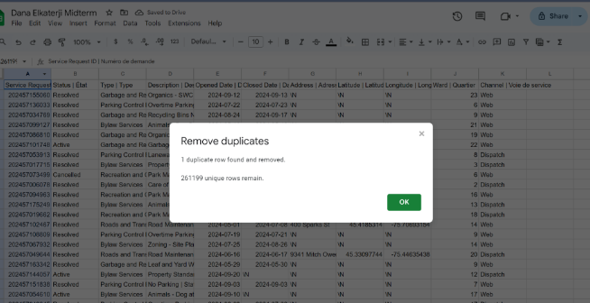

**October 19 2024** 
**MPAD2003 Introductory Data Storytelling** 
**Dana El-katerji** 
**Presented to Jean-Sébastien Marier** 

# Midterm Project: Exploratory Data Analysis (EDA)

## 1. Introduction

In this assignment, I will analyze a dataset from the City of Ottawa regarding issues related to garbage and recycling. The dataset, sourced from Open Ottawa and last updated in [[Original Dataset on the City of Ottawa's website](https://open.ottawa.ca/documents/65fe42e2502d442b8a774fd3d954cac5/about)], captures data collected through various channels, such as counters, dispatches, emails, voice calls, walk-ins, and web submissions. It includes essential information, including complaint types, reasons for reporting, opening and closing dates for each case, and the addresses associated with reported issues. Using Scott Berinato's framework for data storytelling, I will analyze complaint dates and types to uncover key trends and potential resolutions (“Telling Stories with Data in 3 Steps (Quick Study)”). The main sections of this assignment include data acquisition, data cleaning, and analysis, with a focus on identifying community concerns around environmental matters. The original dataset can be accessed on Open Ottawa, and the CSV version is available on my GitHub.

[Original Dataset on the City of Ottawa's website](https://open.ottawa.ca/documents/65fe42e2502d442b8a774fd3d954cac5/about)

[Link to cleaned Google Sheets Dataset](https://docs.google.com/spreadsheets/d/1dkenJONNBqibJUV67I6O0puUyCUSe53IiggUON_v1es/edit?usp=sharing)

## 2. Getting Data

## Steps on how to import data into Google Sheets:

   <b> 1. Download the dataset:</b> Visit the City of Ottawa's open data portal and download the dataset in CSV format onto your computer.

   <b>2. Open Google Sheets: </b> Go to Google Sheet and click on "Blank Spreadsheet" to create a new spreadsheet.

  <b>3. Import the dataset:</b>
<ol>
   <li>Click on <b>File > Import.</b></li>
   <li>Then click on <b>Browse</b> and select the City of Ottawa CSV file that you downloaded earlier.</li>
   <li>Choose <b>“Comma”</b> as your separator type.</li>
</ol>

 
*Figure 1: The "Import file" prompt on Google Sheets.*

 
*Figure 2: The Screenshot of the data" from Dana's computer.*

A public link to your Google Sheets spreadsheet:

[Link to Google Sheets Dataset](https://docs.google.com/spreadsheets/d/1ziFPS-A6Cq9BNfVT8KmRSbGmB0ZRVIJGQr3SPb9ZTYw/edit?usp=sharing)

**General Observations Regarding the Dataset**

The dataset consists of 11 columns and 261,200 rows, providing substantial data for analysis. Each column is clearly labeled, covering critical information such as service type, complaint reasons, and opening and closing dates, which helps in understanding the nature and timeline of each reported issue.

Upon initial review, I identified instances of '/N' in certain cells, indicating missing data entries. This raises potential issues that could affect data completeness and analysis outcomes. However, the majority of the dataset appears well-organized, with most cells containing relevant data aligned with their column labels.

Key Observations: The “Garbage and Recycling” service type is the most commonly reported, suggesting this category may represent a primary concern for residents. In contrast, “Licenses and Permits” appears least frequently, indicating it may be less of a public issue or less commonly reported. This pattern highlights areas where public services may require more attention or resources to address recurring complaints effectively.

Since 'Garbage and Recycling' issues appear frequently, it is essential to understand the underlying causes. This provides a valuable foundation for further analysis, allowing us to investigate trends in community concerns in more detail

**Specific Observations Regarding the Dataset** 

**The dataset includes various types of information:**
<ul>
<ol><b>Column C: Service Type </b>This column categorizes services such as "Water" and "Environment." These are nominal variables, as they represent distinct service types that cannot be ordered or ranked (“Statistics: Power from Data!”).
  </ol>

<ol><b>Column B:Status of the Request</b>  This column indicates whether the request is open, closed, or in progress, also classified as nominal variables. These qualitative values describe the current state of each request without implying any ranking or hierarchy (“Statistics: Power from Data!”).</ol>

<ol><b>Column E & F: Opening and Closing Dates</b> These columns display the submission and closure dates of requests, representing interval-level variables. Dates can be ordered chronologically, making them interval data as they represent arbitrary points in time that can be compared.  
</ol>
  </ul>

<b>Something missing in the dataset</b> 

In Column F, Row 7, the Closed Date is marked as '/N' for a Garbage and Recycling request that was opened on 2024-07-05. This is surprising, as most Garbage and Recycling requests in the dataset have been resolved within a few days or weeks. The absence of this information undermines the reliability of the dataset, as it is missing crucial data that affects overall analysis. This observation aligns with the third step in becoming data literate, which emphasizes understanding data quality and completeness in analysis (Data Literacy: 3 Simple Steps). 

<b>A question or hypothesis that comes in mind when looking at the raw data</b>

When looking at the raw data, there are many instances of '/N,' My question is: Why do most resolved cases not have a closing date? 

## 3. Understanding Data

### 3.1. VIMO Analysis

**VIMO Analysis of the City of Ottawa Dataset**

In the City of Ottawa dataset, a valid data point falls within expected ranges and accurately represents the situation it describes ("Data Accuracy and Validation"). For example, most "Garbage and Recycling" requests are resolved within one week due to the straightforward nature of these tasks and their direct environmental impact ("Garbage and Environment," City of Ottawa). For instance, Column F, Row 2, Column F, Row 4, and Column F, Row 29 are each resolved within one week, demonstrating typical handling times for these cases. 

An invalid example would be Column F, Row 7 and Column F, Row 768, which show active cases without closing dates, remaining open for over three months. This is significantly longer than the typical one-week resolution time, marking these cases as clear outliers. However, outliers are not necessarily invalid there are key diffrences an outlier lies away from the center tendency as for as for missing vales indicate absence data(Data Magic Lab, 2023). Long-standing cases may represent complex, unresolved issues that are still valid, even though they deviate from the norm. They only become invalid if they reflect data entry errors or logical inconsistencies. 

According to the VIMO analysis, missing data is only problematic if essential information—such as a closing date—is absent for resolved cases. In active cases marked as “/N” in the closing date column, this is valid because they remain open. Missing data would be an issue if a closed or resolved case were marked with “/N,” which would indicate missing information. Currently, there are no such missing closing dates for resolved cases, though several addresses are marked as “/N,” indicating missing location data. 

This VIMO analysis shows that while outliers and missing data exist in the dataset, a careful examination helps clarify which entries are valid for analysis. This thorough assessment is crucial for accurately understanding patterns in the data and drawing reliable insights. 

**Refrence**

Data Magic Lab. (2023, October 9). Outlier treatment or missing value imputation: Which comes first? Data Magic Lab. [https://datamagiclab.com/outlier-treatment-or-missing-value-imputation-which-comes-first/](https://datamagiclab.com/outlier-treatment-or-missing-value-imputation-which-comes-first/)

(2020, September 23). Data Accuracy and Validation: Methods to ensure the quality of data. Retrieved November 4, 2024, from [https://www.statcan.gc.ca/en/wtc/data-literacy/catalogue/892000062020008] (https://www.statcan.gc.ca/en/wtc/data-literacy/catalogue/892000062020008) 

### 3.2. Cleaning Data
<b>
1. Removing Unnecessary Columns</b>

The first step I took was to remove unnecessary columns. Simplifying the dataset by keeping only the relevant information makes analysis more straightforward. In this case, I focused on analyzing the relationship between date and type (Garbage and Recycling). Therefore, I deleted columns that were not essential to this analysis, such as Latitude, Longitude, Address, and Ward. To do this, I clicked on the arrow next to each unnecessary column and selected "Delete." This reduced the dataset to only the information I needed.

<b>
2. Filtering Data to Display Only Relevant Types</b>

Next, I filtered the data to focus only on the types Garbage and Recycling. This step helped display only the data necessary for analysis. To do this, I selected all cells, clicked <b> Data > Create a Filter,</b> and activated the filter function. A filter icon appeared in each column header, allowing me to click on the upside-down pyramid in the Type column, where I selected only Garbage and Recycling. This refined the dataset to show only the relevant types, making it easier to analyze

<b>
3. Removing Unnecessary Whitespace </b>

Removing extra whitespace ensures the data is formatted uniformly and is easier for the computer to read. To remove whitespace, I selected all cells, went to<b> Data > Data Cleanup > Trim Whitespace. </b>A popup confirmed how many cells were affected by this step, and the data appeared cleaner and more consistent as a result.

 
*Figure 3: Step1 of Removing Whitespace and Removing Duplicate.*

   
*Figure 4: Removing Whitespace.*
<b> 
4.  Removing Duplicate Service IDs  </b>

Another important step was removing duplicate entries in the Service ID column, ensuring that each ID was unique. I selected the Service ID column, then went to<b> Data > Data Cleanup > Remove Duplicates.</b> After completing this step, a popup indicated the number of duplicates removed. In this case, only one duplicate ID was found and removed.

  
*Figure 5: Removing Duplicate shows that one found and removed.* 

<b>
5. Using the SPLIT Function to Remove French Descriptions
</b>

To make the data easier to read, I removed the French text from the Description column by using the <b>SPLIT</b> function, leaving only the English descriptions. I inserted two new columns to the right of the Description column, clicked on cell E2, and entered the formula <b>=SPLIT(D2, "|"),</b> where D2 is the original cell containing the bilingual description and<b> "|"</b> is the delimiter that separates the English and French parts. I then dragged this formula down to apply it to the entire column. Once split, I copied the resulting English-only column, pasted it as values (using Ctrl+Shift+V), and deleted the original bilingual Description and the French columns. This made the data cleaner and more focused on English descriptions, improving readability.

The function that was used: 
`=SPLIT(D2 ,"|")` 

  
*Figure 6:Result of cleaning the data.* 

### 3.3. Exploratory Data Analysis (EDA)

<b>Why I chose these Variables</b>

I chose these variables to better understand how different channels impact the status of a service request. Including the Service Request ID allowed me to count the number of requests received for each channel. Displaying the data as row percentages made it easier to compare and analyze, revealing the strengths and weaknesses of each channel.

<b>A statistic that stands out to me is </b>
One statistic that stood out to me was the cancellation rate for the "Data In" channel, which is 4.04%. This is the highest cancellation rate across all channels for the Garbage and Recycling request type, suggesting potential issues with this method of service request.

<b>What I learn from using exploratory data analysis 
  </b>
Through this analysis, I observed a strong relationship between service channels and request outcomes. Counter and walk-in channels proved to be the most effective, with the highest resolution rates. In contrast, Email and Data In channels were among the least effective, showing low resolution rates and a high cancellation rate for Data In. This suggests that in-person requests are processed more efficiently than online requests, which may face delays or other issues impacting their performance.

<b>A potential story that could be told is
</b>
A potential story here could focus on why certain service in person channels, like Counter and Walk-in, outperform digital channels like Email and Data In. This story could discuss the benefits of in-person service and highlight potential areas for improvement in digital channels.

<b>Variables and numbers that I want to warrant further investigation </b>

Further investigation into service requests submitted via Email is warranted, as this channel shows the highest rate of active cases, with 23.20% still unresolved, and a low resolution rate of 73.60%. Despite the common use of email for service requests, its performance is the least efficient, with a high cancellation rate and numerous unresolved requests. This suggests challenges in managing or processing email requests effectively, making it a key area for improvement.

**Including a screen capture of my pivot table:**

 
*Figure 7: This pivot table shows relation between channel and states of requst under Garbage and Recycling type*

**This section should also include a screen capture of your exploratory chart, like so:**

 
*Figure 8: This exploratory chart shows elation between channel and states of requst under Garbage and Recycling type*

## 4. Potential Story

This story aims to uncover why digital service channels for Garbage and Recycling, such as email and data submissions, often experience longer delays compared to in-person channels like Counter and Walk-in services. Understanding the reasons behind these delays could reveal if they affect customer satisfaction or environmental outcomes, as faster service can potentially reduce issues like waste buildup. 

To gain a comprehensive understanding, I would need access to customer feedback, reviews, and data from individual service request IDs across channels. This data would allow me to evaluate response times for digital versus in-person channels and measure customer satisfaction levels for each. Insights from this analysis could help determine whether delays in digital channels are justified or if they signal inefficiencies.
I plan to interview two groups to gather varied perspectives. First, customers who experienced delays with digital requests can share how these affected their satisfaction and perceptions of the service. Second, front-line staff handling requests can provide insights into operational challenges that might contribute to these delays. 

Additionally, a Global News article from 2023, which discusses delays at Service Canada locations, offers useful context on how service delays impact public perception and satisfaction. Another valuable resource is the City of Toronto’s 311 Online Service Requests page for Waste Collection, Bins, and Litter. This page provides detailed descriptions of waste management services and potential obstacles for digital request processing, helping to identify possible setbacks across different service channels.

## 5. Conclusion

In this assignment, my primary goal was to understand the delays in garbage collection and recycling. I realized the importance of resolving these issues quickly, as they directly affect our environment. It was alarming to discover some requests had remained open for four months, emphasizing the urgency of addressing these concerns. 

At first, the volume of data in Google Sheets felt overwhelming. The most challenging part was cleaning the data, especially when I tried to use the SPLIT function to separate languages. I struggled with dragging the function down for 28,538 rows, which took a lot of time. I also made a mistake while copying and pasting values when I was using the SPLIT function, accidentally deleting the original data. This led to numerous error messages, and I had to restart my cleaning process. On my second attempt, I learned to use Shift + Ctrl + V to paste values correctly, which helped me avoid previous issues. 

Despite these difficulties, I found cleaning the data the most rewarding. It was satisfying to see my progress and improvements especialy after the SPLIT function succsesfully worked the secand time. While working on Part 3.3, I recognized a gap in my knowledge about displaying effective pivot tables. The challenge was in applying the steps to display the data as I wanted. Looking back, I realize I could have managed my time better and focused more on understanding the data instead of dividing my attention across different tasks. Overall, this experience enhanced my data analysis skills and revealed areas for further growth. 

## 6. References

**QuickStudy. (2019, October 30). _Telling stories with data in 3 steps (Quick Study)_ [Video]. YouTube.**  
Retrieved November 4, 2024, from [https://www.youtube.com/watch?v=r5_34YnCmMY](https://www.youtube.com/watch?v=r5_34YnCmMY)

**(2020, September 23). _Data Accuracy and Validation: Methods to ensure the quality of data._**  
Retrieved November 4, 2024, from [https://www.statcan.gc.ca/en/wtc/data-literacy/catalogue/892000062020008](https://www.statcan.gc.ca/en/wtc/data-literacy/catalogue/892000062020008)

**Kayser, N. (n.d.). Become Data Literate in 3 Simple Steps. DataJournalism.com.** Retrieved November 4, 2024, from [https://datajournalism.com/read/handbook/one/understanding-data/become-data-literate-in-3-simple-steps](https://datajournalism.com/read/handbook/one/understanding-data/become-data-literate-in-3-simple-steps)

**311 Online Service Requests - Waste Collection, Bins and Litter. (n.d.). City of Toronto. Retrieved November 4, 2024**  
Retrieved November 4, 2024, from [https://www.toronto.ca/home/311-toronto-at-your-service/find-service-information/article/?kb=kA06g000001d1s8CAA](https://www.toronto.ca/home/311-toronto-at-your-service/find-service-information/article/?kb=kA06g000001d1s8CAA)

**Global News. (2023, November 1). Large lineups continue at Service Canada locations.**  
Retrieved November 4, 2024, from [https://globalnews.ca/news/8785642/large-lineups-continue-at-service-canada-locations](https://globalnews.ca/news/8785642/large-lineups-continue-at-service-canada-locations)
